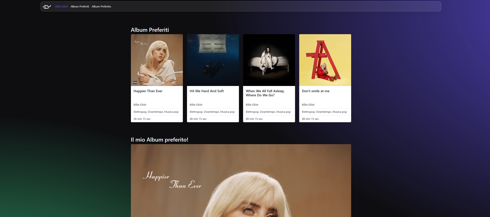

# Billie Eilish Albums Showcase

<p align="center">
  <a href="https://github.com/EmanWeBdV/EPICODE_M3-W2D1">
    
  </a>
</p>

<p align="center">
  A responsive <strong>music showcase webpage</strong> dedicated to Billie Eilish, built with HTML and CSS.<br/>
  Focus on layout composition, card-based presentation, modern styling and visual hierarchy.<br/>
  <strong>This project was created during Module M3 of the Epicode course.</strong>
</p>

<p align="center">
  <a href="https://github.com/EmanWeBdV/EPICODE_M3-W2D1">
    
  </a>
  <a href="https://github.com/EmanWeBdV/EPICODE_M3-W2D1/issues">
    
  </a>
  <a href="#">
    
  </a>
</p>

<p align="center">
  <a href="#-preview">Preview</a>
  ·
  <a href="#-demo">Demo</a>
  ·
  <a href="https://github.com/EmanWeBdV/EPICODE_M3-W2D1/issues">Report a bug</a>
  ·
  <a href="https://github.com/EmanWeBdV/EPICODE_M3-W2D1/issues">Request a feature</a>
</p>

---

## ✨ Preview

<p align="center">
  
</p>

---

## 🔗 Demo

- **Live demo:** https://emanwebdv.github.io/EPICODE_M3-W2D1/

---

## 🧭 Table of Contents

- [Preview](#-preview)
- [Demo](#-demo)
- [Features](#-features)
- [Tech Stack](#-tech-stack)
- [Project Structure](#-project-structure)
- [Installation](#-installation)
- [Usage](#-usage)
- [Responsiveness](#-responsiveness)
- [Roadmap](#-roadmap)
- [Author](#-author)
- [License](#-license)
- [Disclaimer](#-disclaimer)

---

## 🚀 Features

- **Music-themed interface**
  - Webpage dedicated to Billie Eilish
  - Visual presentation focused on favorite albums
  - Dark modern aesthetic with a strong visual identity

- **Albums section**
  - Dedicated section for **favorite albums**
  - Card-based layout for album presentation
  - Album covers, titles, artist name, genres and duration

- **Featured favorite album**
  - Separate section for the main personal favorite album
  - Highlighted presentation with image and album details

- **Modern UI styling**
  - Dark background with radial gradient effects
  - Glassmorphism-inspired navbar
  - Clean spacing and card-focused composition

- **Educational Context**
  - Built as a frontend exercise to practice Bootstrap-style layout composition, custom CSS styling and content organization

---

## 🧱 Tech Stack

<p align="left">
  
  
  
</p>

---

## 📂 Project Structure

```bash
.
├── index.html
├── assets
│   ├── css
│   │   └── styles.css
│   └── img
│       ├── preview6.png
│       └── ...other album images
└── README.md
